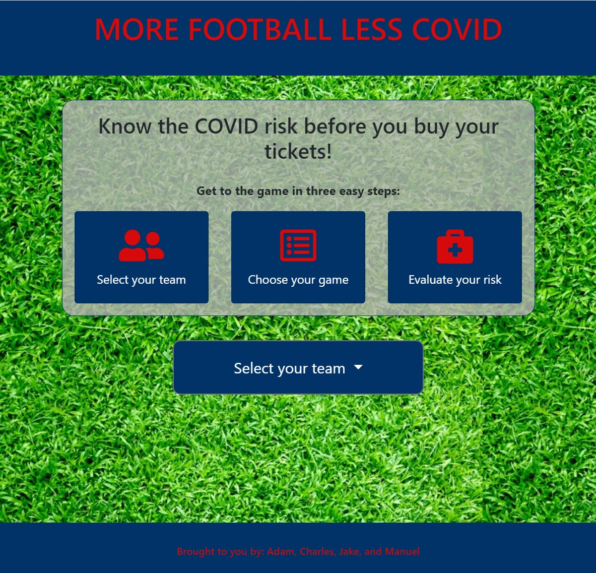

# MoreFootballLessCovid
Project 1 for Rutgers Coding Bootcamp 
https://manuelpierre.github.io/MoreFootballLessCovid/

This app was developed in recognition of two facts - NFL fans want to attend football games this season, but they also want to minimize their risk of contracting COVID-19. Version 1.0 of *MoreFootballLessCOVID* allows the user to evaluate the risk of attending games around the NFL. 

## Functionality

Select the desired team from the drop-down menu. Upon selection, the app will return a list of home games, with each matchup color-coded by the opposing team's colors. 

Below that, will be 4 general statistics about the stadium and/or state in which the team plays:
* Number of Cases - Total confirmed and probable cases for a given state.
* State Risk Level - Based on the daily increase in confirmed and probable cases for the given state, a risk level of "average" or "high" is determined.
* Adjusted Capacity - This value is calculated based on the State Risk Level and standard reported stadium capacity, and represents our recommended adjusted maximum.
* Empty Seats Between - This is recommended number of seats between spectators. It's based on the State Risk Level, and is a social distancing recommendation.

Finally, A Google StreetView image will be displayed, either of the inside or outside of the stadium, depending on available imagery.

## Technology

The app uses HTML, CSS, JavaScript, and jQuery. Sports information is obtained from various APIs available at https://sportsdata.io/. COVID-19 information is from https://covidtracking.com/. Imagery is from https://cloud.google.com/maps-platform/maps. The application was developed to be mobile-responsive using "mobile-first" techniques.

## Development Roadmap
Future versions of the app will:
* Provide additional matchup information 
* Connect to ticket purchase platforms
* Obtain region- or county-level COVID data so the risk determination is more specific

## Project Team
This app was the result of hard work by Adam Jones, Charles Metzger, Jake Simon, and Manuel Pierre.

## Screenshots
Upon loading the page, before selecting a team: 

After selecting a team from the drop-down menu: 

